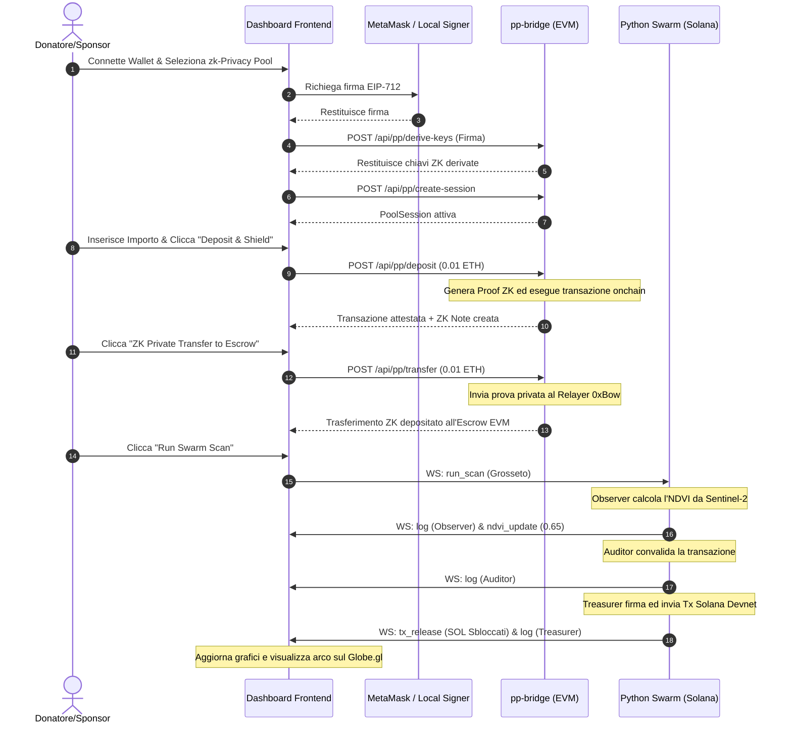

# NAura — Frontend & Backend Integration Manual

> [!IMPORTANT]
> ### MERGE & INTEGRATION PROTOCOL
> Use this section to audit, merge, or generate frontend-backend hooks.
>
> | Frontend Component | Target File | Action Required | State Properties |
> | :--- | :--- | :--- | :--- |
> | **MVVM Model** | [model.js](/model.js) | Define state flags for connections and active notes list. | `ppBridgeConnected`, `ppMode`, `sepoliaBalance`, `keysDerived`, `ppSessionActive`, `notes` (Array), `txList` (Array) |
> | **MVVM ViewModel** | [viewmodel.js](/viewmodel.js) | Implement fetch bindings to port `3001` and WebSocket triggers to port `8000`. | `checkPPBridgeStatus()`, `deriveKeys()`, `executeDeposit()`, `executePrivateTransfer()`, `runSwarmScan()` |
> | **MVVM View** | [view.js](/view.js) | Cast values safely (`Number()`, `String()`) to prevent `toFixed`/`substring` UI crashes. | `statEscrowLocked`, `statTotalReleased`, `selectTransferNote` options population |
> | **EVM Bridge** | [pp-bridge/server.js](/pp-bridge/server.js) | Use `FORCE_SIMULATION` fallback and prefix SHA256 circuit manifest CIDs. | `/api/pp/status`, `/api/pp/derive-keys`, `/api/pp/create-session`, `/api/pp/deposit`, `/api/pp/transfer` |
> | **Solana Swarm** | [backend/agent_swarm.py](/backend/agent_swarm.py) | Stream progress events via WebSockets to coordinate with View HUD logs. | `run_scan` action handler, WebSockets `events` route |
>
> **Verification Commands for AI Agents:**
> * Check server syntax: `node --check pp-bridge/server.js` (EVM Bridge)
> * Verify Python syntax: `python -m py_compile backend/agent_swarm.py` (AI Swarm)
> * REST Endpoint check: `curl -s http://localhost:3001/api/pp/status` (expected JSON response)

This document details the MVVM integration architecture of **NAura**, detailing how the 3D dashboard connects to the decentralized backend systems, how MetaMask interacts with the application, and the full lifecycle of API/WebSocket communications.

---

## Architectural Overview

NAura uses a decoupled, event-driven **MVVM (Model-View-ViewModel)** design system:

```mermaid
graph TD
    subgraph Browser (Frontend)
        View[index.html / view.js] <--> ViewModel[viewmodel.js]
        ViewModel <--> Model[model.js]
    end
    subgraph EVM Payment Layer (Localhost:3001)
        BridgeServer[pp-bridge/server.js]
        SDK[@0xbow-io/privacy-pools-v2-sdk]
        BridgeServer --> SDK
    end
    subgraph Solana Reforestation Layer (Localhost:8000)
        SwarmServer[backend/agent_swarm.py]
        SwarmAgents[Observer, Auditor, Treasurer]
        SwarmServer --> SwarmAgents
    end
    ViewModel <-->|HTTP REST Requests| BridgeServer
    ViewModel <-->|WebSocket Events| SwarmServer
    MetaMask[MetaMask Extension] <-->|EIP-1193 / EIP-712| ViewModel
```

---

## Backend Installation & Start Guide

To run the live integration, both backend components must be running locally:

### 1. The EVM ZK-Privacy Pool Bridge (Node.js)
The payment bridge manages local EVM wallets, signs transactions, and interacts with the Ethereum Sepolia Privacy Pools v2 SDK.

```bash
cd pp-bridge
npm install
npm run dev
```
* Runs on: `http://localhost:3001`
* Configured via: `pp-bridge/.env` (stores RPC URL, Donor/Escrow private keys, Relayer/ASP endpoints).
* *Note: When running without an internet connection or if IPFS gateways are down, the server defaults to `FORCE_SIMULATION=true` mode.*

### 2. The Solana AI Swarm Server (Python)
The swarm server performs Sentinel-2 NDVI raster math and triggers conditional Solana Devnet releases.

```bash
# Setup virtual environment & dependencies
python3 -m venv venv
source venv/bin/activate
pip install -r backend/requirements.txt

# Run the WebSocket orchestrator
python backend/agent_swarm.py
```
* Runs on: `ws://localhost:8000/events`
* Monitors raster files in `backend/data/`.

---

## MetaMask Integration Guide

In NAura, the frontend interacts with MetaMask (or any EIP-1193 injector) for wallet connection and cryptographic key derivation.

### 1. Connection Request (Standard Web3)
The frontend establishes a connection with MetaMask to read the user's Sepolia address:
```javascript
async function connectMetaMask() {
  if (typeof window.ethereum === 'undefined') {
    alert("MetaMask is not installed. Running in simulated local wallet mode.");
    return;
  }
  try {
    const accounts = await window.ethereum.request({ method: 'eth_requestAccounts' });
    const address = accounts[0];
    console.log("Connected MetaMask account:", address);
    return address;
  } catch (err) {
    console.error("User rejected wallet connection:", err);
  }
}
```

### 2. ZK Key Derivation via EIP-712 Signatures
Privacy Pools v2 requires zero-knowledge keys to manage notes (Nullifiers, Viewing Keys, Secret Keys). To avoid storing seed phrases, these keys are derived deterministically by signing a typed EIP-712 payload.

#### EIP-712 Payload Structure:
```javascript
const eip712Domain = {
  name: "Privacy Pools",
  version: "2.0.0-beta",
  chainId: 11155111, // Sepolia
};

const eip712Types = {
  DeriveKeys: [
    { name: "message", type: "string" },
    { name: "addressHash", type: "bytes32" },
  ]
};

const eip712Message = {
  message: "Sign this message to derive your Privacy Pools ZK key material. This does not cost any gas.",
  addressHash: "0x..." // sha256 hash of user address
};
```

#### Requesting the MetaMask Signature:
The frontend requests MetaMask to sign this typed data. The resulting signature is sent to the backend bridge server to securely derive the keys using `CryptoService`:
```javascript
const signature = await window.ethereum.request({
  method: "eth_signTypedData_v4",
  params: [address, JSON.stringify({
    types: eip712Types,
    domain: eip712Domain,
    primaryType: "DeriveKeys",
    message: eip712Message,
  })],
});

// Post signature to backend to derive keys and load the session
const response = await fetch("http://localhost:3001/api/pp/derive-keys-sig", {
  method: "POST",
  headers: { "Content-Type": "application/json" },
  body: JSON.stringify({ signature, address }),
});
```

---

## HTTP API Specifications (EVM Bridge)

All REST calls are handled on `http://localhost:3001`.

| Endpoint | Method | Description | Request Payload | Response Payload |
| :--- | :--- | :--- | :--- | :--- |
| `/api/pp/status` | **GET** | Fetches active EVM configuration, Sepolia balances, and bridge status. | *None* | `{ sdkAvailable: boolean, donorAddress: string, escrowAddress: string, donorSepoliaBalance: string, escrowSepoliaBalance: string, keysDerived: boolean, sessionActive: boolean, bridgeBalanceEth: string }` |
| `/api/pp/derive-keys` | **POST** | Triggers local signing and key derivation on the bridge. | `{ address: string }` | `{ identityNullifier: hex, identitySecret: hex, viewingKey: hex, spendingKey: hex, mode: "real"\|"simulated" }` |
| `/api/pp/create-session` | **POST** | Initializes a `PoolSession` with the derived keys, relayers, and circuit gateway overrides. | *None* | `{ status: "session_created", mode: "real"\|"simulated" }` |
| `/api/pp/deposit` | **POST** | Deposits Sepolia ETH into the ZK privacy pool, registers the commitment, and issues a private ZK Note. | `{ amount: string }` | `{ status: "deposited", mode: "real"\|"simulated", commitment: hex, amount: string, note: { commitment: hex, value: number, status: "ACTIVE" } }` |
| `/api/pp/public-deposit` | **POST** | Bypasses Privacy Pools, transferring Sepolia ETH directly from the donor wallet to the escrow address. | `{ amount: string }` | `{ status: "deposited", mode: "real"\|"simulated", txHash: hex, amount: string, bridgeBalanceEth: string }` |
| `/api/pp/discover-notes` | **POST** | Scans the IPFS/ASP state to discover unspent active ZK notes owned by the derived key material. | *None* | `{ notes: Array<{ commitment: hex, value: number, status: "ACTIVE" }>, mode: string }` |
| `/api/pp/transfer` | **POST** | Relays a ZK proof via the 0xBow relayer, transferring private notes to the escrow receiver address. | `{ amount: string, commitment?: hex }` | `{ status: "transferred", mode: "real"\|"simulated", txHash: hex, amount: string, bridgeBalanceEth: string }` |
| `/api/bridge/balance` | **GET** | Allows the Solana AI agents to query the accrued bridge balance available for cross-chain unlock triggers. | *None* | `{ balanceWei: string, balanceEth: string, escrowAddress: string }` |

---

## WebSocket Event Specifications (Solana AI Swarm)

Connection URL: `ws://localhost:8000/events`

### 1. Outgoing Messages (Frontend Python Server)

#### Run Scan Request
Fires when the user clicks the **Run Swarm Scan** button in the dashboard, instructing the Observer, Auditor, and Treasurer agents to download Sentinel imagery, compute NDVI, and draft the release tx.
```json
{
  "action": "run_scan",
  "projectId": "grosseto"
}
```

---

### 2. Incoming Messages (Python Server Frontend)

#### Swarm Console Log Stream
Streams live typewriter dialogue logs from the executing agents to the scrolling terminal display.
```json
{
  "type": "log",
  "tag": "observer" | "auditor" | "treasurer" | "system",
  "message": "Downloading Sentinel-2 imagery for coordinates...",
  "logType": "observer" | "auditor" | "treasurer" | "system"
}
```

#### NDVI Update Event
Pushes the computed Sentinel-2 NDVI vegetative index results. Triggers the split-screen satellite image slider transition in the UI.
```json
{
  "type": "ndvi_update",
  "projectId": "grosseto",
  "ndvi": 0.68
}
```

#### Scan Status Change
Updates the consensus state HUD next to the button.
```json
{
  "type": "scan_status",
  "status": "idle" | "running" | "consensusing" | "completed"
}
```

#### Escrow Release Event
Broadcasts the successful settlement of a Solana Devnet escrow release. Triggers the 3D visual arc transition on the globe and adjusts locked/released balances.
```json
{
  "type": "tx_release",
  "projectId": "grosseto",
  "txHash": "5uVqB9...",
  "escrowDelta": -4.20,
  "releasedDelta": 4.20
}
```

---

## Full Integration Process Flow

When a user funds a project and runs a scan:


